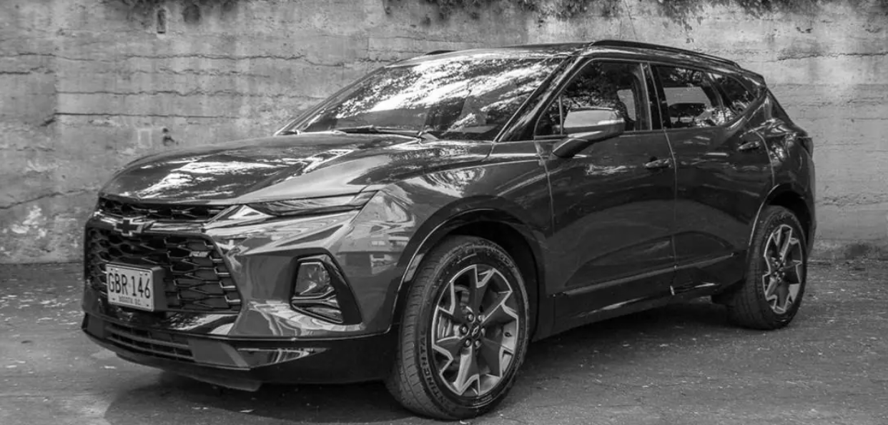
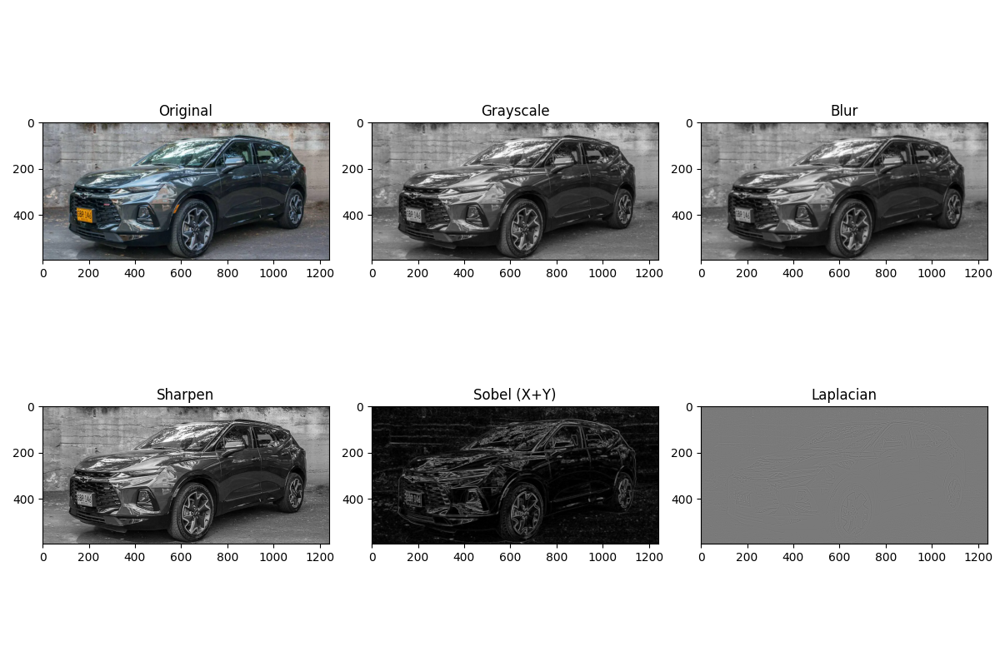

# 2025-05-02_taller_ojos_digitales

## Objetivo
Explorar los principios básicos de la visión por computador utilizando OpenCV: trabajar con imágenes en escala de grises, aplicar filtros convolucionales y realizar detección de bordes con Sobel y Laplaciano.

---

## Flujo de procesamiento

1. Se carga una imagen a color.
2. Se convierte a escala de grises.
3. Se aplican filtros:
   - Desenfoque (Gaussian Blur)
   - Enfoque (Sharpen)
4. Se detectan bordes con:
   - Filtro Sobel (X, Y y combinado)
   - Filtro Laplaciano
5. Se visualizan y comparan los resultados.

---

## Visualización (GIF)

---

## Comparación visual (imagen)

---

## Código relevante

El procesamiento completo fue realizado en un Notebook de Google Colab usando `OpenCV`, `NumPy` y `Matplotlib`.

---

## Comentarios

Este taller me permitió comprender cómo las computadoras interpretan imágenes mediante matrices y convoluciones. La diferencia entre los filtros y su efecto visual fue clara al comparar los resultados. La mayor dificultad fue ajustar el tipo de datos al combinar los resultados (por ejemplo, el uso de `.astype(np.uint8)`).

---

## Herramientas usadas

- Python (Colab)
- OpenCV
- NumPy
- Matplotlib
- imageio (para generar GIFs)

---

## Criterios cubiertos

- ✅ Conversión a escala de grises.
- ✅ Aplicación de filtros (blur y sharpen).
- ✅ Detección de bordes con Sobel y Laplaciano.
- ✅ Comparación visual clara.
- ✅ Código funcional, limpio y estructurado.
- ✅ GIF animado con los resultados.
- ✅ Commits realizados en inglés.
- ✅ README completo con evidencias.
